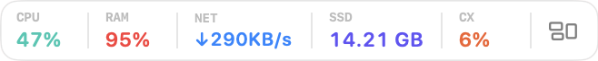
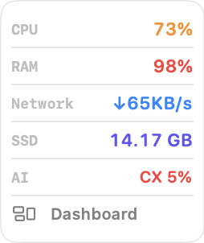
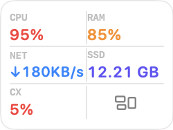

# CC-Overlay

> [한국어](README_KO.md) · [Release notes](RELEASE_NOTES.md) · [Product](PRODUCT.md) · [Contributing](CONTRIBUTING.md) · [Security](SECURITY.md)

**Decide whether your Mac and AI capacity are ready before you start coding.**

CC-Overlay is a local-first macOS capacity copilot for developers who use Codex and Claude Code. It keeps the signals that can interrupt an intensive AI coding run in one small, always-available surface: Mac health, provider headroom, reset timing, and the next safe action.

It is an independent open-source utility and is not affiliated with Anthropic or OpenAI.

## See the overlay

Choose the shape that fits the space you have. Every layout exposes the same CPU, RAM, network, SSD, AI usage, and dashboard controls.

| Horizontal | Vertical | Two columns |
|:---:|:---:|:---:|
|  |  |  |
| Smallest single-row footprint | One readable metric per row | Balanced grid for narrow spaces |

The screenshots are captured from the `v1.1.1` local build. Values reflect a live Mac sample and do not represent a promise of a particular capacity level.

## Make a capacity decision in one glance

Before you begin a run, CC-Overlay helps you answer three questions:

1. **Is the Mac ready?** Check CPU, memory pressure, thermal state, free storage, and the supporting network signal.
2. **Which provider has usable headroom?** See locally available Codex and Claude Code usage windows, resets, and seven-day headroom history.
3. **What should I do now?** The dashboard's **Next action** card explains whether to run now, run with caution, refresh, switch provider, wait for capacity, or wait for the Mac to recover.

The decision order is deliberate: critical Mac conditions take precedence, then provider setup or refresh needs, then limits, resets, and provider switching. A caution state never disguises the reason, and a critical Mac state never invents a recovery time.

| Next action | When it appears | What it tells you |
|---|---|---|
| **Wait for Mac** | Critical memory pressure or thermal state | Do not start an intensive run; check again after the Mac reports recovery. |
| **Refresh / Set up** | Provider data is stale, unavailable, or needs configuration | Reconnect or refresh before relying on a provider recommendation. |
| **Wait / Switch / Use reset** | Available provider capacity is constrained | Use the earliest known reset, another provider, or an applicable Codex reset. |
| **Run with caution** | Warning pressure, serious thermal state, CPU or RAM at 90%+, or less than 10 GiB free storage | The run can start, but the card states the specific Mac risk. |
| **Run now** | No blocking provider or Mac condition | Start with the recommended provider and confidence level. |

Network and battery remain visible context in this release; they do not block a recommendation by themselves.

## What is on screen

### Floating overlay

- **System signals:** CPU, RAM, network transfer rate, free SSD space, and the most constrained locally available AI provider.
- **Three persistent layouts:** Choose **Horizontal**, **Vertical**, or **Two columns** from the overlay's right-click **Layout** menu or from **Settings → Overlay**. The chosen layout is restored after restart.
- **Focused details:** Click CPU, RAM, network, SSD, or AI usage for a compact detail popover. The AI popover includes the same 48-point-high, seven-day multi-provider headroom chart used by the dashboard. Until history exists, it keeps the chart area and explains how local history is built.
- **Dashboard:** Use the trailing grid button for the Next action card, 60-minute CPU and memory trends, storage, battery when present, thermal state, and accessible top processes.

The overlay stays within the current display while you drag it, works over full-screen apps, and can pass pointer input through to the app below when **Click-through** is enabled.

### Provider and project insight

Open the dashboard's usage details to compare the current provider windows with seven days of private local headroom history. The Project activity section groups the last 24 hours by project, shows the top three first, and can expand to the complete local list.

| Provider | Local insight | Cost semantics |
|---|---|---|
| **Codex** | Combines `session_meta.cwd` with positive changes in local cumulative rollout token counters. Repeated or decreasing counters do not inflate totals. | Shows **Codex local tokens** and capacity contribution only. It never presents a dollar amount as actual Codex billing. |
| **Claude Code** | Aggregates local JSONL sessions by project, model, and tokens. OAuth rate-limit access remains opt-in. | Shows a dollar figure only when it is explicitly labeled **Claude local API-equivalent estimate**. |

Only the final directory name is shown as a project label. Raw paths, conversation content, and token ledgers are not added to preferences, safe diagnostics, or CSV exports. A malformed local record or safe read-limit stop only affects its project card; rate-limit monitoring continues.

## Install and update

```bash
brew tap jadru/cc-overlay
brew install cc-overlay
cc-overlay
```

Update an existing installation with:

```bash
brew update
brew upgrade cc-overlay
```

Enable **Launch at login** in Settings when you want CC-Overlay to start with macOS. It deliberately does not install a Homebrew background service.

To remove it, disable Launch at login and run:

```bash
brew uninstall cc-overlay
```

## Use it day to day

- Press `Cmd+Shift+A` to toggle the overlay.
- Right-click the overlay to open the dashboard, switch layouts, hide the overlay, or quit.
- Use **Settings → Overlay** to confirm the saved layout, choose whether the overlay appears in every app or only recognised developer tools, and enable click-through.
- Click the dashboard's gear button to open Settings directly.
- If you hide the overlay from its context menu, CC-Overlay temporarily appears in the Dock. Use **Overlay → Show Overlay** to restore it.

## Configuration

| Setting | Default | Description |
|---|---:|---|
| Overlay layout | Horizontal | Horizontal, vertical, or two-column presentation; the choice persists locally. |
| Overlay visibility | Every app | Show in every app or only recognised developer tools. |
| Show floating overlay | On | Shows or hides the floating system monitor. |
| Click-through | Off | Passes pointer input to the app underneath. |
| Global hotkey | On | Toggles the overlay with `Cmd+Shift+A`. |
| Usage threshold alerts | On | Alerts at configured provider-usage thresholds. |
| Claude OAuth rate limits | Off | Reads Claude Keychain credentials only after explicit opt-in. |
| Launch at login | Off | Starts CC-Overlay with macOS. |

## Data and privacy

CC-Overlay has no developer-operated backend. It contacts provider-owned services only for requested usage metadata and GitHub Releases when automatic update checks are enabled.

| Data | Purpose | Storage and boundary |
|---|---|---|
| CPU, memory, network, storage, power, and thermal state | Local system-capacity display | Latest 60 minutes in memory only; never transmitted. |
| Provider headroom, reset metadata, and preferences | Capacity recommendation and overlay behavior | Stored locally on your Mac. |
| Codex rollout counters and Claude JSONL records | Local project activity and token insight | Processed locally; raw paths, conversation content, and token ledgers are not newly persisted or exported. |
| Claude OAuth credentials | Optional Claude rate-limit lookup | Requested only after opt-in and kept in existing macOS/Claude storage. |

Review the source and use a release you trust before enabling a provider. Safe diagnostics exclude credentials, project names, usage history, and local paths.

## Build and verify

Requires Swift 6.0+ and the macOS 15+ SDK.

```bash
git clone https://github.com/jadru/homebrew-cc-overlay.git
cd homebrew-cc-overlay
./script/build_and_run.sh
swift test
```

Run universal packaging checks without notarization:

```bash
VERSION=0.0.0 BUILD_NUMBER=0 SIGN_IDENTITY=- NOTARIZE=0 ARCHS="arm64 x86_64" ./script/package_release.sh
```

Tagged releases are signed and notarized universal app bundles. Verify a Homebrew installation with:

```bash
APP="$(brew --prefix cc-overlay)/CC-Overlay.app"
codesign --verify --deep --strict --verbose=2 "$APP"
spctl --assess --type execute --verbose=4 "$APP"
```

## License and feedback

[MIT](LICENSE). Use **Settings → Advanced → Share product feedback** or open a [feedback issue](https://github.com/jadru/homebrew-cc-overlay/issues/new?template=user_feedback.yml).
